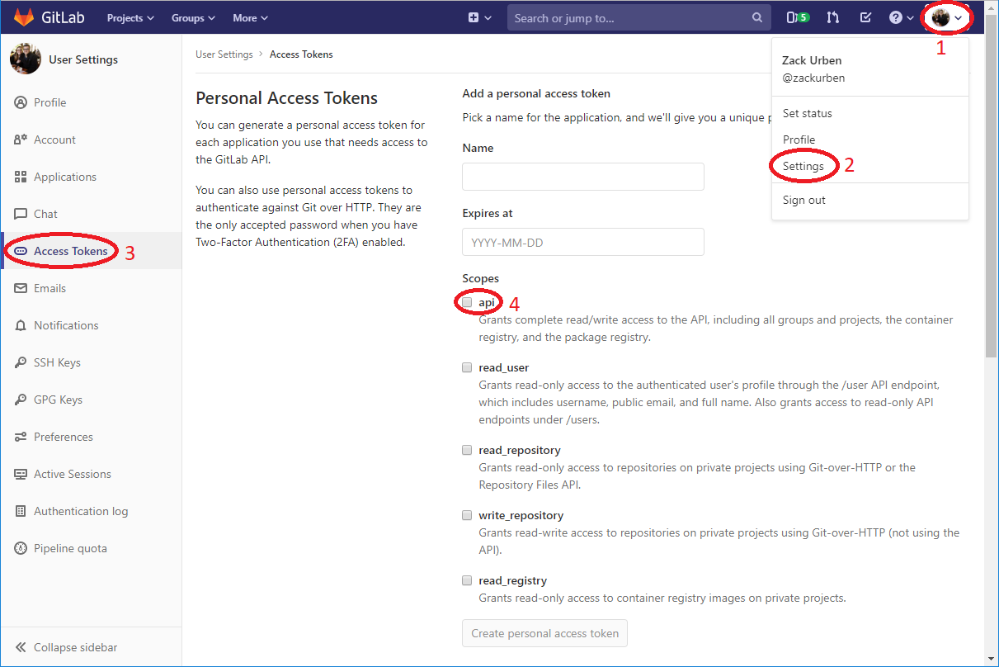

# Setup

- [GitLab](#gitlab)
  - [.env](#env)
  - [CLI usage](#cli-usage)
  - [Generating a Token](#generating-a-token)

## GitLab

To get ISREN working for GitLab, you much provide an _Access Token_. The Token
can be provided in one of two places:

- `.env` file
- `auth` CLI param, see [Options: Authentication](/README.md#authentication)

### .env

```bash
AUTH=example_token
```

### CLI usage

```bash
isren https://gitlab.com/foo/bar --auth example_token
```

> Note: The CLI parameter takes precedence over the environment variable

### Generating a Token

To generate a new GitLab token with the correct permissions, use the following
steps:

1. Click on your profile image in the top right of GitLab
2. Go to your profile _Settings_
3. Open the _Access Tokens_
4. Create a new _Personal Access Token_ with the `api` _scope_ enabled.

Now you're prepared to use isren as an authenticated user! Use this token as a
CLI param or add it to your `.env` file for automatic injection.


